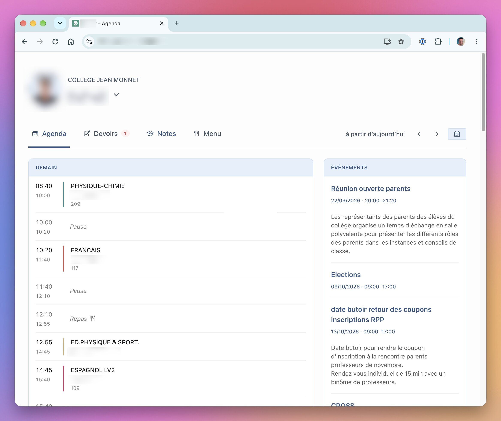
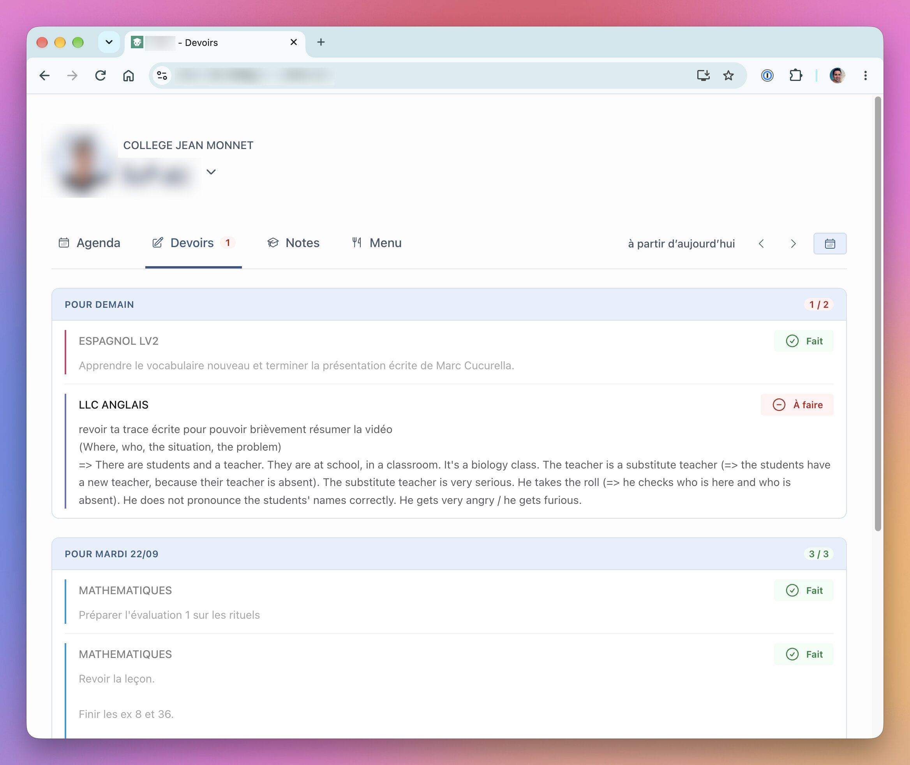
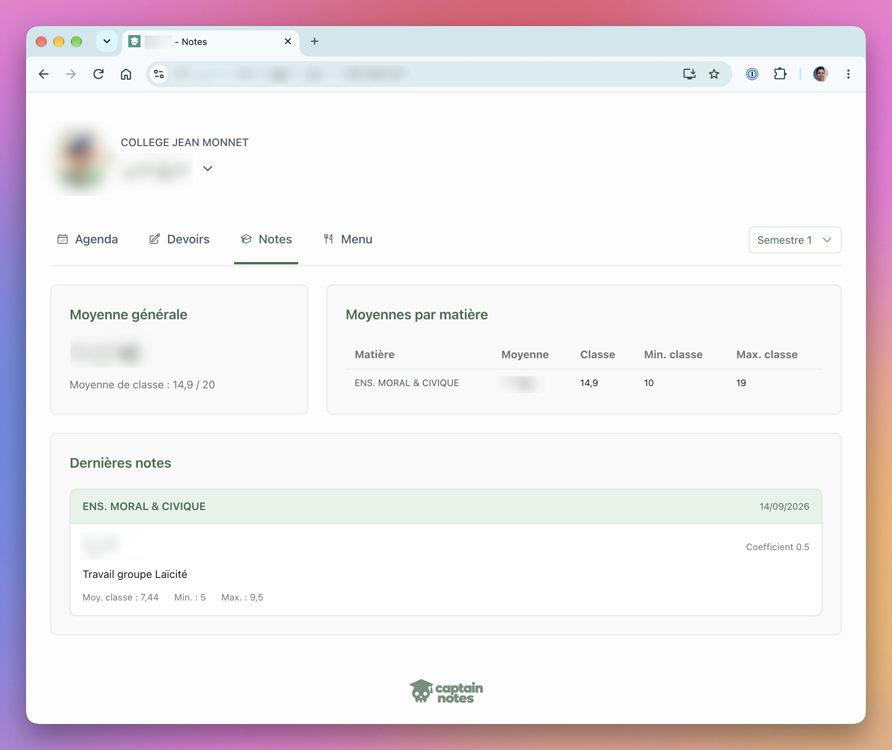
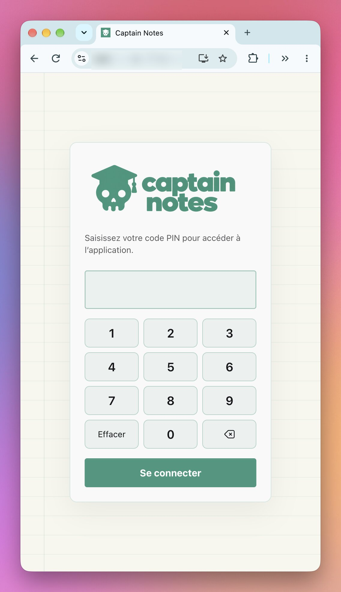
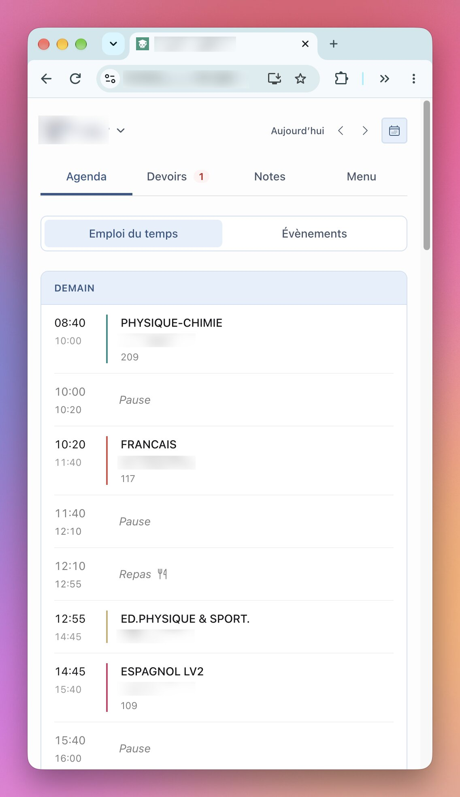
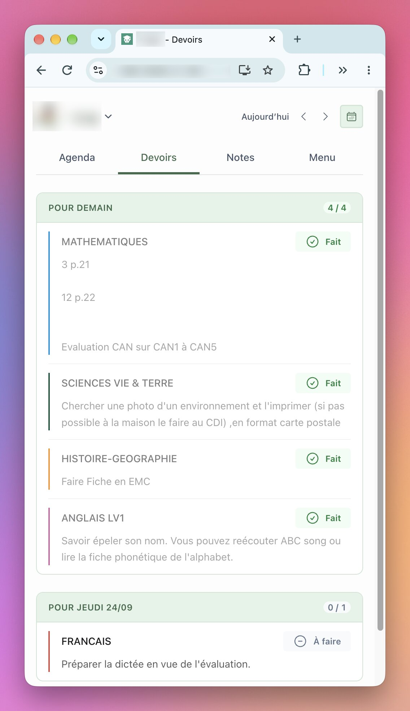

# Captain Notes

## Description du projet

Une interface PRONOTE pour consulter l’agenda, les devoirs, les notes, les menus et les messages des enfants, avec un seul identifiant.

La motivation est de donnée l'accès avec un seul identifiant familial, aux données pronote de toute la famille, tout en donnant accès à certaines fonctionnalités normalement restreintes au compte des enfants (marquer les devoirs faits, lire les messages personnels...)

L'application a été développée dans un objectif de simplicité, toutes les fonctionnalités de pronote ne seront pas portées.

Développée avec Elixir et Phoenix LiveView. Ne nécessite pas de base de données.

## Roadmap

- [x] emploi du temps
- [x] liste des devoirs 
- [x] liste des notes
- [x] menu de la cantine
- [x] évènements
- [x] version mobile
- [x] thèmes jours / nuits
- [x] marquer les devoirs faits
- [x] sécurisation avec code PIN
- [x] mode PWA (ajouter l'app à l'accueil du smartphone)
- [x] consulter les messages des enfants
- [ ] consulter les messages des parents (sécurisé)
- [ ] consulter les resources associées aux devoirs

## Screenshots

### Desktop







### Mobile

<p>
  
  
  
</p>

## Lancer le projet en local

Prérequis : Elixir et Erlang/OTP (versions utilisées par Docker : Elixir 1.19.4 et OTP 28).

```sh
mix setup
cp -n .envrc.example .envrc
```

Compléter `.envrc` :

- `PRONOTE_URL` : URL HTTPS directe vers `parent.html` (connexion sans ENT ni QR code).
- `PRONOTE_USERNAME` et `PRONOTE_PASSWORD` : identifiants du compte parent.
- `PINCODE` : facultatif, exactement 8 chiffres. Vide ou absent, l’application est accessible sans authentification. Une connexion est valable 12 heures.

Les variables `PRONOTE_CHILD_n_*` du fichier exemple permettent de personnaliser les enfants. Les identifiants élève sont facultatifs et nécessaires pour marquer les devoirs comme faits et consulter les messages. La rubrique Messages est accessible depuis le menu utilisateur ; le marquage lu/non lu est explicite et enregistré dans PRONOTE.

```sh
source .envrc
mix phx.server
```

Ouvrir [localhost:4000](http://localhost:4000). Après modification des variables, les recharger et redémarrer le serveur. Avec direnv, `direnv allow` remplace `source .envrc`.

Pour lancer les vérifications : `mix precommit`.

## Construire et lancer en production avec Docker

Prérequis : Docker avec Buildx et Compose. Depuis le dossier du projet, construire l’image Linux amd64 :

```sh
docker buildx build --platform linux/amd64 --load -t pronotex:local .
cp -n .env.docker.example env
chmod 600 env
```

Compléter le fichier **`env`** (nom attendu par `docker-compose.yml`) avec les mêmes variables PRONOTE qu’en local, sans `export`, puis renseigner :

- `PHX_HOST` : nom de domaine de l’application, sans protocole ni chemin.
- `SECRET_KEY_BASE` : secret généré avec `mix phx.gen.secret`, à conserver lors des mises à jour.

Les secrets ne sont pas intégrés à l’image. Ne pas versionner `env`. Pour les avatars, utiliser les variables `PRONOTE_CHILD_n_AVATAR_BASE64` décrites dans le fichier exemple.

```sh
docker compose up -d
docker compose ps
docker compose logs --tail=100 -f pronotex
```

Le conteneur écoute sur **127.0.0.1:4123** sur la machine hôte. Configurer un reverse proxy avec un certificat valide pour servir `https://<PHX_HOST>` et transmettre les requêtes vers `http://127.0.0.1:4123`, avec `X-Forwarded-Proto: https` et la prise en charge des WebSockets. HTTPS est nécessaire aux cookies de connexion en production.

Pour déployer sur une autre machine, exporter l’image :

```sh
docker save -o pronotex-image.tar pronotex:local
```

Transférer l’archive, `docker-compose.yml` et le fichier `env` sur la machine cible, puis exécuter dans leur dossier :

```sh
docker load -i pronotex-image.tar
docker compose up -d --force-recreate
```

Pour une mise à jour, reconstruire l’image (et la transférer si nécessaire), puis relancer `docker compose up -d --force-recreate`. Cette commande est également nécessaire après une modification de `env`. Aucun volume de base de données n’est requis.
